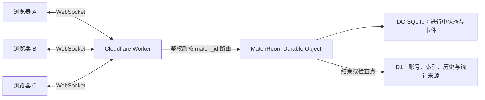

# 台球计分应用：后续总路线图

更新时间：2026-08-10

当前状态：P0 已完成验收，进入 R3 实施阶段

R3 技术决策基线：[docs/R3_TECHNICAL_DECISIONS.md](docs/R3_TECHNICAL_DECISIONS.md)

---

## 1. 当前结论

后续版本按以下顺序推进：

1. **R3 / v5.0.0：账号、Cloudflare D1 与跨设备同步**
2. **R4 / v5.1.0：多人同时参加一局并实时共同操作**
3. **R5 / v5.2.0：牌组、历史、统计与分享**
4. **R6 / v6.x：新玩法与娱乐模式**

关键边界：

- R3 与 R4 连续设计，但不合并开发和发布。
- R3 先解决账号、权限、云端持久化、迁移和单设备写入，并预留 R4 所需的数据与命令协议。
- R4 在 R3 稳定后引入 Durable Objects 和 WebSocket，承担实时房间、顺序写入、广播和重连。
- 15 人左右的私用规模，按 Cloudflare 当前免费额度预计可保持零成本；上线后仍需观察实际请求量和持久化用量。

---

## 2. 已完成基线

### R1 / P0：发布护栏与首期收口（已验收）

- [x] GitHub CI 覆盖 lint、测试和构建
- [x] 桌面与移动端关键流程验收
- [x] 未结束对局的继续、保存后新建和放弃流程
- [x] 本地数据异常恢复和安全重置入口
- [x] 正式部署、冒烟测试和回滚流程

### R2 / v4.0.0：本地核心功能完整版（已完成）

- [x] 完整奇招、轻量、竞技和安全等官方牌组
- [x] 每场保存牌组版本与完整快照，旧对局不受后续修改影响
- [x] 2—8 人本地多人计分
- [x] 玩家分别设置初始积分、中途加入、离场和重新排序
- [x] 固定轮转、胜者开球等顺序策略
- [x] 转账型计分、自定义计分项和特殊规则
- [x] 事件备注、补录和保留原记录的更正机制
- [x] 手动抽牌、自动补牌、手牌上限和牌库耗尽处理
- [x] 卡牌事件与计分事件联动、撤销和时间线恢复
- [x] 本地历史、未结束对局恢复和旧版本数据迁移

现有本地玩法和离线能力必须在后续版本继续可用，不能因接入云端而退化。

---

## 3. R3：账号、云端存储与跨设备同步

目标版本：**v5.0.0**

优先级：**P1**

前置条件：P0 已完成

### 3.1 已确认技术决策

- [x] 后端采用 Cloudflare Worker
- [x] 主数据库采用 Cloudflare D1 免费层
- [x] 只使用用户名和密码登录，不接入邮箱验证
- [x] 注册必须填写固定邀请码；不开放公开注册
- [x] 邀请码通过 Worker Secret `REGISTRATION_INVITE_CODE` 配置，不写入 Git、前端或文档
- [x] 邀请码不按时间自动过期，采用常量时间直接比较
- [x] 密码使用 HMAC-SHA256 摘要，密钥放入 `PASSWORD_HMAC_KEY` Worker Secret
- [x] 会话令牌只保存 HMAC 摘要，密钥放入 `SESSION_HMAC_KEY` Worker Secret
- [x] 服务端会话不因时间或长期未登录自动失效
- [x] 用户、对局、预设、牌组和联系人数据不因不活跃自动删除
- [x] 云端对局默认仅本人可见
- [x] R3 采用“单主写设备”策略，不实现多设备离线冲突合并

详细安全口径、数据保留规则和故障边界以现有 [R3 技术决策文档](docs/R3_TECHNICAL_DECISIONS.md) 为准。

### 3.2 实施流程

#### 阶段 1：Cloudflare 工程与基础设施

- 新建 Worker 项目并接入现有前端
- 创建开发和生产 D1 数据库及迁移目录
- 配置同源 API 路由、CORS、Cookie 和安全响应头
- 通过 Wrangler 交互式写入三个 Secret：
  - `REGISTRATION_INVITE_CODE`
  - `PASSWORD_HMAC_KEY`
  - `SESSION_HMAC_KEY`
- 建立开发、预览、生产三套环境变量
- 保留当前 Vercel 版本作为回滚入口

#### 阶段 2：账号与会话

- 实现受邀请码保护的注册接口
- 实现用户名规范化、唯一性检查和保留字规则
- 实现 HMAC-SHA256 密码摘要及常量时间比较
- 实现登录、退出、查看当前会话和管理员撤销会话
- 会话 Cookie 使用 `HttpOnly`、`Secure`、`SameSite=Lax`
- 浏览器 Cookie 丢失时只要求重新登录，不删除云端数据
- 对注册和登录接口增加基础频率限制

#### 阶段 3：D1 数据模型与权限

- 创建用户、会话、对局、参与者、事件、联系人和同步设备表
- 所有用户数据按 `owner_user_id` 或明确成员关系隔离
- 所有 API 在服务端鉴权，不能只依赖前端隐藏入口
- 所有写操作使用事务、唯一约束或条件更新，防止重复提交
- 建立按用户、对局、更新时间和版本号查询的索引
- 建立数据导出和管理员手动删除入口

#### 阶段 4：为 R4 预留的数据与命令协议

R3 不开放实时多人共同写入，但必须提前固定以下契约，避免 R4 重写核心数据：

- 每局拥有稳定的 `match_id` 和单调递增的 `match_version`
- 每个操作拥有客户端生成的 `operation_id`，服务端据此去重
- 每条事件拥有服务端分配的 `sequence_no`
- 参与者与账号分离：`match_player_id` 表示局内选手，`user_id` 表示登录账号
- 预留 `host`、`player`、`spectator` 三种房间角色
- 前端通过业务命令提交修改，不上传并覆盖整份对局状态
- 命令至少包含：`match_id`、`operation_id`、`expected_version`、命令类型和参数
- 牌库抽取、随机结果和最终版本号由服务端决定
- 事件记录保持追加式；更正通过新事件表达，不直接篡改旧事件

R3 中这些字段用于云端持久化、幂等和未来兼容；真正的 WebSocket 房间和并发调度由 R4 实现。

#### 阶段 5：本地数据迁移与跨设备同步

- 首次登录扫描现有本地玩家、预设和对局
- 向用户展示待迁移数量和迁移范围
- 用户确认后批量上传，且同一批次可安全重试
- 本地对象保存云端 ID、版本号和最后同步时间
- 离线时允许继续本地单机计分并进入待上传队列
- 恢复联网后自动补传；同一场云端对局只允许一个主写设备
- 非主写设备默认只读，用户明确接管后才能继续写入
- 接管必须校验服务端版本，发现版本落后时先刷新再操作

#### 阶段 6：前端入口与状态反馈

- 增加注册、登录、退出和账号状态入口
- 未登录时保留当前本地单机能力
- 显示“仅本地、待同步、同步中、已同步、同步失败、只读”状态
- 提供手动重试、重新登录和从云端恢复入口
- 明确提示跨设备接管和未同步风险

#### 阶段 7：测试、发布与回滚

- 单元测试：规范化、HMAC、邀请码、权限、幂等和版本判断
- 集成测试：注册、登录、退出、迁移、上传、拉取、接管和撤销会话
- 故障测试：断网、重复请求、Worker 重试、D1 失败和 Cookie 丢失
- 兼容测试：现有本地存档、移动端和无账号模式
- 先发布预览环境，再灰度到少量账号，最后切换生产入口
- 验收后保留旧 Vercel 版本一段观察期

### 3.3 R3 验收标准

- [ ] 用户只能凭正确邀请码注册
- [ ] 用户名和密码可完成注册、登录与退出
- [ ] 密码、会话令牌和邀请码明文不会落入 D1、日志或 Git
- [ ] 长期未登录不会导致服务端会话或用户数据自动清除
- [ ] 同一账号可在另一台设备读取已同步数据
- [ ] 旧本地数据可以确认后迁移，重复执行不会产生重复记录
- [ ] 离线创建的单机对局可在恢复联网后上传
- [ ] 非主写设备不会静默覆盖较新数据
- [ ] 用户之间不能读取或修改未授权数据
- [ ] 现有本地模式、构建和核心测试全部保持通过
- [ ] R4 所需的版本号、操作 ID、事件序号和角色字段已经落库并有测试

### 3.4 R3 明确不做

- 不在 v5.0.0 引入 Durable Objects 或 WebSocket
- 不允许两台设备同时修改同一场进行中的对局
- 不实现自动合并多设备离线操作
- 不做邮箱、短信、OAuth 或自助找回密码
- 不开放公开注册、公开主页或公共数据浏览
- 不在 R3 同时开发 R5、R6 功能

---

## 4. R4：多人实时共同参加一局

目标版本：**v5.1.0**

优先级：**P2**

前置条件：R3 稳定上线，账号、权限、事件版本和幂等机制通过验收

### 4.1 用户流程

1. 已登录用户创建实时房间，成为 `host`
2. 系统生成短房间码和可分享链接
3. 其他已登录用户通过房间码加入，成为 `player` 或 `spectator`
4. 房主选择局内选手、玩法、牌组和权限后开始对局
5. 所有在线成员接收同一份快照与后续事件
6. 有权限的成员提交计分、回合、犯规、抽牌等业务命令
7. 服务端按唯一顺序执行并广播确认后的结果
8. 断线用户重连后先取得最新快照，再补齐缺失事件
9. 对局结束后生成不可歧义的最终记录并归档到 D1

远程实时操作默认要求账号登录。未注册的本地玩家仍可作为局内选手，但不能从另一台设备进入房间并写入。

### 4.2 推荐架构

- 每场进行中的对局对应一个 `MatchRoom` Durable Object
- Worker 负责登录鉴权和把连接路由到正确房间
- Durable Object 负责串行处理命令、分配事件序号、去重和广播
- 进行中状态及关键事件先持久化到 DO 的 SQLite，再向客户端广播成功
- 使用 WebSocket Hibernation API，空闲连接不持续占用活动时长
- D1 保存账号、成员关系、历史索引、已完成对局及后续统计所需投影
- DO 写入 D1 失败时保留待归档状态并重试，不能把未落库结果伪装成已完成

### 4.3 并发与一致性规则

- 客户端只发送业务命令，不发送“用我的整份状态覆盖服务器”
- 每条命令必须携带唯一 `operation_id`，重复到达只执行一次
- 每条命令携带 `expected_version`；版本过旧时拒绝或要求刷新
- Durable Object 为成功事件分配连续 `sequence_no`
- 同一房间中的命令由一个 Durable Object 顺序执行
- 抽牌、洗牌和随机结果由服务端生成，客户端只展示结果
- 房主、玩家、观战者分别执行权限检查
- 撤销或纠错生成补偿事件，不删除已经确认的事件
- 客户端只在收到服务端确认后把操作标记为完成

### 4.4 断线、恢复与异常处理

- 客户端记录最后收到的 `sequence_no`
- 短暂断线重连时请求缺失事件；差距过大时直接下载最新快照
- 共享对局的写入必须在线，断网期间界面进入只读或“等待重连”
- 不把多台设备各自离线产生的共享对局修改自动合并
- Durable Object 被休眠或重新调度后，从持久化状态恢复房间
- 房主离线时允许按规则移交主持权，不能由任意成员自行夺取
- 房间长时间无人连接时可休眠，但对局数据不因休眠而删除
- 已结束房间只读；继续修改必须创建更正事件或新对局

### 4.5 前端体验

- 显示房间码、成员、角色、在线状态和当前操作者
- 显示连接中、已同步、等待确认、已断线和需要刷新状态
- 对暂未确认的命令提供明确的等待反馈，避免重复点击
- 版本冲突时自动刷新并说明哪项操作没有成功
- 房主可管理成员角色、开始/结束对局和移交主持权
- 观战者只能读取，不显示可写操作入口

### 4.6 测试与容量验证

- 2、5、15 个客户端同时加入同一房间
- 两个玩家几乎同时提交命令
- 同一 `operation_id` 重发多次
- 客户端断线、换网、刷新页面和后台恢复
- Durable Object 休眠、重启与状态恢复
- 无权限用户伪造房间 ID 或角色
- D1 暂时失败时的归档重试
- 长时间对局、事件数量增长和快照压缩
- 监控 Durable Objects 请求数、持续时间和存储用量

### 4.7 R4 验收标准

- [ ] 15 个以内在线用户可稳定进入和退出房间
- [ ] 多人同时操作时，所有客户端最终看到完全相同的顺序和状态
- [ ] 重复请求不会重复计分、重复抽牌或重复推进回合
- [ ] 断线重连后无需手工修复即可恢复到最新状态
- [ ] 观战者和无权限成员不能修改对局
- [ ] 服务端决定随机结果，客户端不能自行指定抽牌结果
- [ ] 房间休眠或实例重建后不会丢失已经确认的操作
- [ ] 对局结束后可从 D1 读取完整且一致的历史
- [ ] 免费额度接近阈值时有可观察的指标，而不是突然产生未知费用

### 4.8 费用判断

按 15 人左右的私用规模，Cloudflare Workers、D1 和 SQLite-backed Durable Objects 的免费额度预计足够。主要消耗来自 WebSocket 入站消息、Durable Object 活跃时长和 SQLite 读写；使用休眠 WebSocket、只广播必要事件并减少高频心跳后，通常不需要付费。

上线时仍应设置用量提醒，并在预览环境进行一次 15 客户端压力测试。免费额度与计费政策可能变化，实施 R4 前需再次核对 Cloudflare 官方文档。

参考：

- [Durable Objects 概览](https://developers.cloudflare.com/durable-objects/)
- [Durable Objects 定价与免费额度](https://developers.cloudflare.com/durable-objects/platform/pricing/)
- [WebSocket Hibernation 示例](https://developers.cloudflare.com/durable-objects/examples/websocket-hibernation-server/)

---

## 5. R5：牌组、历史、统计与分享

目标版本：**v5.2.0**

优先级：**P3**

前置条件：R3 云端数据稳定；R4 的实时事件和已完成对局可可靠归档

### 5.1 牌组系统

- 默认牌组
- 自定义牌组
- 牌组复制、删除和设为默认
- 与账号绑定并跨设备同步
- 牌组版本升级与兼容

### 5.2 历史记录

- 按玩法、玩家和日期筛选
- 展示完整计分过程和关键事件
- 区分本地单机、云端单设备和实时多人对局
- 允许对已结束对局追加更正记录

### 5.3 统计页

- 玩家参与次数、胜率和近期趋势
- 常用玩法和牌型分布
- 单局与长期数据分层展示
- 统计数据从已完成对局投影生成，不直接扫描进行中房间

### 5.4 分享

- 生成只读结果页或图片
- 默认不暴露账号资料和未授权历史
- 分享链接可撤销
- 公开分享与房间实时邀请使用不同权限令牌

### 5.5 R5 验收标准

- [ ] 牌组可跨设备读取与维护
- [ ] 历史记录能准确还原不同来源的对局
- [ ] 统计结果可由原始完成事件复算
- [ ] 分享页只暴露用户明确选择的数据

---

## 6. R6：新玩法与娱乐模式

目标版本：**v6.x**

优先级：**P4**

前置条件：核心账号、实时房间、历史和统计链路稳定

候选方向：

- 玩法预设与自定义规则
- 连胜、限时、挑战和随机事件模式
- 赛事或小型联赛
- 更丰富的复盘和观战体验
- 由实际使用反馈决定的实验功能

R6 不在当前阶段锁定具体范围；应根据 R3—R5 的真实使用数据再排序。

---

## 7. 下一次实施迭代：只完成 R3

下一迭代应实现 **R3 / v5.0.0**，不同时启动 R4 的实时通信层。

必须完成：

1. Worker、D1、迁移和环境配置
2. 邀请码注册、用户名密码登录和无时间过期会话
3. 用户级数据隔离和服务端权限检查
4. 旧本地数据确认迁移
5. 离线队列与单主写设备策略
6. R4 所需的 `match_version`、`operation_id`、`sequence_no`、角色与命令封装
7. 自动化测试、预览验收、生产发布和回滚验证

本次不做：

- Durable Objects
- WebSocket 实时房间
- 多设备同时修改同一场对局
- 牌组、统计和分享界面
- 新玩法和娱乐模式

这样可以先验证账号、权限、迁移和数据可靠性，再把实时并发风险集中在 R4 处理。

---

## 8. 总版本表

| 阶段 | 建议版本 | 状态 | 核心交付 |
|---|---:|---|---|
| R1 / P0 | v4.x | 已验收 | CI、生产发布、回滚、兼容性与恢复基线 |
| R2 | v4.0.0 | 已完成 | 本地多人计分、完整规则、牌组快照与事件模型 |
| R3 | v5.0.0 | 下一步 | 账号、D1、跨设备同步、R4 协议预留 |
| R4 | v5.1.0 | 已规划 | Durable Objects 实时多人共同对局 |
| R5 | v5.2.0 | 待规划 | 牌组、历史、统计与分享 |
| R6 | v6.x | 候选 | 新玩法与娱乐模式 |

版本号可在实施前根据实际发布历史调整，但阶段顺序和依赖关系不变。

---

## 9. 每个版本的发布门槛

### 9.1 代码门槛

- lint 通过
- 单元测试和集成测试通过
- 生产构建通过
- 数据库迁移可重复执行并可验证
- 新增关键路径有回归测试

### 9.2 数据门槛

- 旧数据迁移方案已验证
- 重复请求不会产生重复数据
- 失败重试不会破坏状态
- 权限隔离有反向测试
- 对局事件可以复算最终状态

### 9.3 体验门槛

- 移动端关键流程可完成
- 弱网和断网状态有明确反馈
- 登录失效、只读、冲突和同步失败不会静默发生
- R4 起必须清楚显示在线成员、角色和连接状态

### 9.4 运维门槛

- 有预览环境
- 有错误日志和关键用量指标
- 有生产回滚入口
- Secret 不进入源码、构建产物和普通日志
- Cloudflare 免费额度接近阈值时可发现并处理

---

## 10. 暂不纳入近期版本

以下能力暂不进入 R3—R5：

- 公开社区或公共主页
- 公开注册
- 支付、订阅或商业化
- 大规模赛事平台
- 跨区域大型房间和复杂匹配系统
- 自动合并多设备离线产生的实时对局分支
- 原生移动应用

若实际用户长期保持约 15 人，应优先保证稳定、简单和可恢复，而不是提前建设大规模平台能力。
